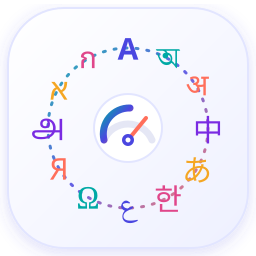

<p align="center">
  
</p>

<h1 align="center">Project Bornomala &nbsp;বর্ণমালা</h1>

<p align="center">
  <b>A Bengali-first language technology programme.</b><br/>
  Tokenization, document recognition, dialect documentation, speech, and foundation modelling.
</p>

<p align="center">
  
  
  
  
</p>

---

## What this is

Project Bornomala rests on a single, attackable empirical claim:

> The binding constraint on Bengali language modelling is not compute or
> architecture. It is the absence of a large, clean, high-register Bengali
> corpus (because that corpus exists only as page images), and the total
> absence of any computational resource for the Bengali dialects of West Bengal.

The causal arrow runs **OCR into corpus into model**, not the reverse. The full
argument, the five tracks (A Tokenization, B Document Recognition, C Dialect
Documentation, D Speech, E Foundation Model), the roadmap, the phase gates, and
the risk register live in the technical specification:

- **[PROJECT_BORNOMALA_Technical_Specification.md](PROJECT_BORNOMALA_Technical_Specification.md)** (Draft 1.0)

## Subprojects

Bornomala is built as focused, shippable subprojects. Each is self-contained.

| Subproject | Track | What it does | Status |
|---|---|---|---|
| **[MotherTongueIndex](mothertongueindex/)** | A (support) | Measures how efficiently mainstream LLM tokenizers encode any language, versus English. An understanding tool for token efficiency and the reasoning-capability cost of tokenization. | Active |
| Bengali tokenizer | A | The Bornomala grapheme-cluster-aware, literary-weighted Bengali tokenizer. Lives in this main repo. | Planned |
| Bengali document OCR | B | VLM-based Bengali document recognition, grapheme-aware metrics, pre-1950 letterpress. | Planned |
| West Bengal dialect corpus | C | First computational resource for the five West Bengal dialect groups. | Planned |

> **Note.** MotherTongueIndex is a **subproject**. It does not train the
> Bornomala tokenizer. The Track A Bengali tokenizer is a separate deliverable
> in this main repo. MotherTongueIndex will benchmark it once it exists, by
> adding it to the model registry alongside GPT, Llama, Gemma, Sarvam, and the
> rest.

## Repository layout

```
bornomala/
├── PROJECT_BORNOMALA_Technical_Specification.md   parent spec (the plan)
├── mothertongueindex/                             subproject: tokenizer efficiency analyzer
│   ├── mti/        core engine (CPU only)
│   ├── web/        light Material 3 website + API
│   ├── docs/       research paper, architecture, assets
│   ├── data/       multilingual samples + generated tables
│   └── eval/       measured cross-language reasoning probe
├── LICENSE         Apache-2.0
├── CONTRIBUTING.md · CODE_OF_CONDUCT.md · SECURITY.md · CITATION.cff
└── .github/        CI, issue and PR templates
```

## Licensing

Code is **Apache-2.0**. Corpora and datasets produced by the programme are
released **CC BY 4.0** or **CC BY-SA 4.0** (spec section 17.3). A restrictive
licence on a cultural corpus produced from community speech is not defensible
and is not used here.

## Citation

See [CITATION.cff](CITATION.cff). Principal investigator: Konko Maji
(work.konkomaji@gmail.com).
