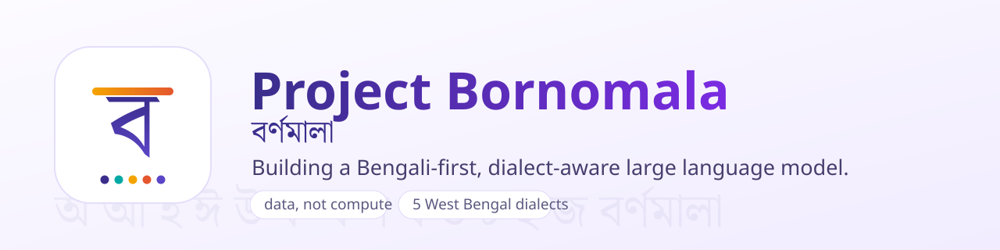

  

  <b>Preserving Bengali in the age of AI.</b> 
  A first-of-its-kind, non-commercial research effort, based in West Bengal, to build a Bengali-first, dialect-aware language model and to preserve the richness of the Bengali language and its culture.

  
  
  
  
  

<b><a href="https://konkomaji.github.io/bornomala/">Read the project website</a></b>

---

## What this is

Bengali is spoken by more than 250 million people, yet the systems shaping the
future of knowledge were built for English first. Project Bornomala exists to
change that for Bengali: to build a language model that reads and writes Bengali
the way Bengali is actually used, including its literary depth and the dialects
of West Bengal that no system covers today.

It is research, not a product, and it is non-commercial for now. Everything is
open, and every claim is measured and stated with the data behind it.

## The problem

- **General AI treats Bengali as second-class.** ChatGPT, Claude, and Gemini
  split Bengali into far more pieces than English for the same meaning, so it
  costs more and less of it fits in memory. They also routinely break a Bengali
  conjunct, the single written unit a reader recognises, into fragments.
- **Even Indic models leave Bengali thin.** Sarvam and AI4Bharat have done
  valuable open work, but they optimise across many Indian languages at once and
  cover Standard Bengali, not the literary register or the western dialects.
- **Bangladesh has built a great deal, and we honour it,** but it centres on
  Standard and Dhaka-region Bangla. The western half of the language is still
  missing. We take that up as a complement, not a competitor.
- **The corpus is trapped.** A century of Bengali literature exists mostly as
  scanned page images. That is a data problem, not a compute problem.

## What it will achieve

A Bengali-first, dialect-aware model that understands literary register, idiom,
and regional voice, and can run offline on an ordinary phone. Along the way, the
open tools and data to make it possible: a tokenizer that respects the script,
the recovery of the trapped literary corpus, and the first computational record
of the West Bengal dialects, collected with consent and care. This is language
preservation carried out with modern tools.

## What we have achieved so far

**A Bengali tokenizer that leads the field.** Measured on held-out Bengali, it
needs the fewest tokens per word and almost never breaks a conjunct, where every
other system breaks many.

| Tokenizer | Tokens per word | Whole words kept | Bytes per token | Broken conjuncts |
|---|--:|--:|--:|--:|
| **Bornomala (ours)** | **1.52** | **72%** | **11.38** | **0.01%** |
| IndicBERTv2 (AI4Bharat) | 1.65 | 61% | 10.50 | 4.4% |
| XLM-RoBERTa (Meta) | 2.46 | 36% | 7.04 | 10.2% |
| Sarvam-1 (Sarvam AI) | 2.59 | 42% | 6.69 | 11.9% |
| GPT-4o (OpenAI) | 2.61 | 11% | 6.65 | not measurable |
| mBERT (Google) | 2.78 | 39% | 6.25 | 18.0% |
| DeepSeek-V3 | 2.99 | 9% | 5.79 | 28.5% |

This holds up beyond Wikipedia, too: measured separately on literary/formal,
general web, and news held-out text, ours needs the fewest tokens per word,
keeps the most whole words, and breaks the fewest conjuncts against IndicBERTv2
on every one of those registers as well (fragmentation stays at essentially
zero, 0.00-0.01%, on all four), not only the one shown above. Full per-register
numbers:
[`bengali-tokenizer/benchmarks/bengali-comparison.md`](bengali-tokenizer/benchmarks/bengali-comparison.md).

> **How this was measured, so anyone can check.** Our tokenizer was trained on
> a literary-weighted corpus (Wikisource, Sangraha, Wikipedia, XL-Sum news; see
> the benchmarks doc for the full mix). It was then tested, along with every
> other tokenizer, on 828 held-out lines from Bengali Wikipedia articles never
> seen in training. Every other tokenizer is its real, official public
> tokenizer, run on the same text. A broken conjunct is a written unit split
> across a token boundary, computed from each tokenizer's own character
> offsets; GPT-4o exposes none, so its figure is left unmeasured rather than
> guessed. The full method and raw numbers are in the repository, and the
> comparison reruns with one command.

**An open tool that makes the inequity visible.** MotherTongueIndex lets anyone
paste text in any language and see how many more tokens it costs than English
across 28 model tokenizers, and the reasoning cost that follows.

## Our values

- **Transparent.** Every number states the data behind it. No estimate is ever
  presented as a measurement.
- **Open.** Code under Apache 2.0, data under open Creative Commons licences.
- **Cultural.** Rooted in the richness of Bengali literature, idiom, and dialect.
- **Consensual.** Dialect and speech data collected with informed consent, fair
  compensation, and the right to withdraw.

## Help build it

This is bigger than one person. Engineers, native speakers of West Bengal
dialects, linguists, and archives are all needed. Start on
[GitHub](https://github.com/konkomaji/bornomala), read the
[website](https://konkomaji.github.io/bornomala/), or write to
work.konkomaji@gmail.com.

## Licence

Code is **Apache-2.0**. Data and corpora are released **CC BY 4.0** or
**CC BY-SA 4.0**. See [CITATION.cff](CITATION.cff). Founder and principal
investigator: Konko Maji.
