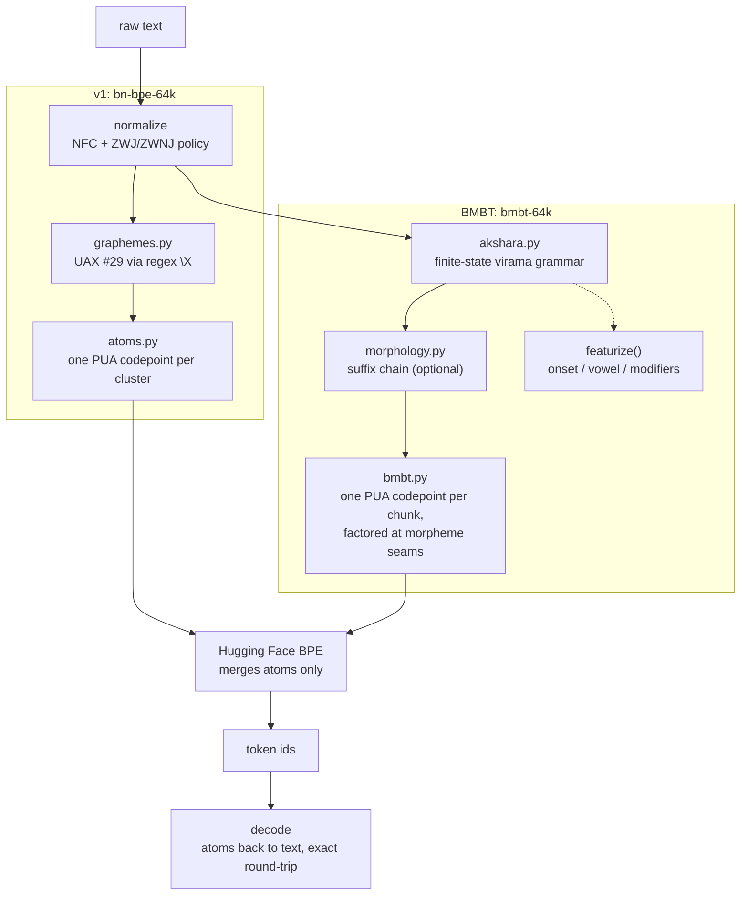
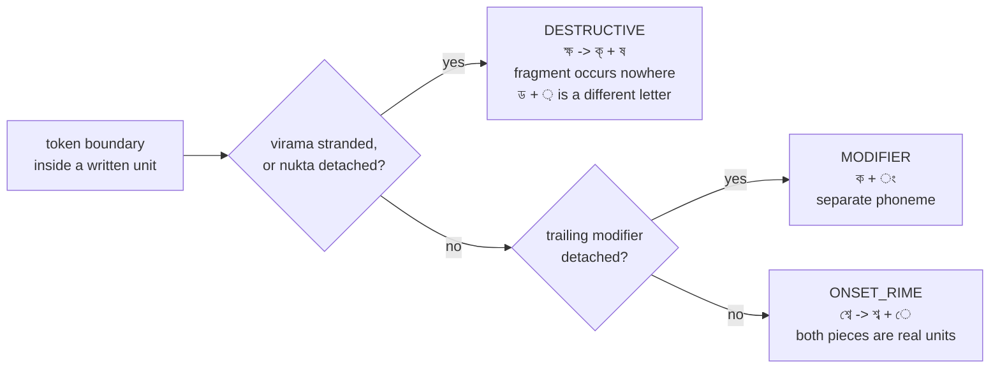

<p align="center">
  
</p>

<h1 align="center">BMBT &nbsp;<sub>Bornomala's Bengali Tokenizer &middot; Project Bornomala, Track A</sub></h1>

<p align="center">
  <b>A Bengali tokenizer that parses the script's own grammar instead of discovering it statistically.</b><br/>
  Finite-state akshara parser, featural decomposition, conjunct fragmentation near-zero by construction.
</p>

<p align="center">
  
  
  
  
  
</p>

---

## Why this exists

Bengali script is an abugida. A written unit (a base consonant with its
conjuncts, reph, phalas, matra, and signs) spans several codepoints but reads as
one symbol. Most tokenizers, including this project's own first version,
*discover* that structure statistically (BPE merges over grapheme clusters).
**BMBT parses it directly**, from Bengali's own generative grammar (the virama
rule, a finite-state machine, not a statistical guess), and only then trains a
statistical layer on top for what the grammar can't explain (loanwords,
code-mixing, noise).

## Two tokenizers, two architectures

I ship **two** complete Bengali tokenizers here. They are not a draft and a
replacement. They are two different answers to the same problem, and I measure
both on identical held-out text.

| | **v1 `bn-bpe-64k`** | **BMBT `bmbt-64k`** |
|---|---|---|
| Atomic unit | UAX #29 grapheme cluster | akshara, parsed by grammar |
| How structure is found | discovered statistically | parsed from the virama rule |
| Depends on | `regex`'s `\X` implementation | its own finite-state machine |
| Fertility (Wiki/lit/web/news/Banglish/FLORES+) | 1.524 / 1.320 / 1.195 / 1.142 / 2.906 / 1.241 | 1.524 / 1.320 / 1.195 / 1.142 / 2.905 / 1.240 - identical on 5 of 6, BMBT edges v1 by 0.001 on FLORES+ |
| Conjunct integrity | absolute | absolute |
| Structural output | none | `featurize()`: onset, vowel, modifiers |
| Morphology | none | suffix chain, 100% of seams reachable |
| Segmentation speed | 2.72 M cp/s (`\X`, C) | **6.20 M cp/s** (vectorized) |
| Status | shipped, published on Hugging Face | shipped, in this repository |

**They tie on compression, and that is what I expected, not a disappointment.**
`docs/design/FORMAL_SPEC.md` proves a grammar-constrained BPE cannot beat an
unconstrained one on raw token count, and akshara boundaries are
near-isomorphic to grapheme-cluster boundaries on well-formed Bengali, so the
two atom schemes are close to the same scheme on real text. On Wikipedia
held-out they match down to the raw integer token count. Across all six
registers now measured they tie exactly on five and differ by 0.001 fertility
on the sixth (FLORES+, BMBT ahead) - real, small, reported rather than
smoothed over.

What separates them is everything else. BMBT owes nothing to a third-party
Unicode library for its correctness, it emits a real structural decomposition
of every akshara, it aligns its token boundaries to Bengali's morpheme
boundaries, and it now segments faster than the C regex v1 hands the job to.

## The tokenizer tax, and how this design answers it

Srivastava (2026), [*The Tokenizer Tax*](https://arxiv.org/html/2607.24276v1),
measures word fertility across 10 Indian languages and 6 tokenizers on
FLORES-200 and reports each language's cost as a multiplier over English. It is the clearest statement of the problem I built this to solve, someone else
wrote it, and its diagnosis points straight at the mechanism my design removes.

### What the paper found for Bengali

| | Value |
|---|--:|
| Tax multiplier, cl100k_base | **6.52x** English |
| Unmerged single-byte token rate | **37.2%** |
| Effective context window against an English user | **16.9%** |
| Bytes per token | 2.19 |

Across tokenizers the Bengali tax is 10.73x (GPT-2), 6.52x (cl100k), 5.65x
(Qwen), 2.10x (mBERT), 1.91x (o200k), 1.54x (XLM-R). The Gini coefficient
across languages falls from 0.35 (cl100k) to 0.19 (o200k) to 0.14 (XLM-R),
which is the paper's core argument: **the tax is a design choice, not a
property of the scripts.**

### The mechanism it identifies

The dominant cause is **unmerged single-byte tokens**: where a tokenizer's
vocabulary does not cover a script, its BPE merges fail to combine that span's
bytes and the text decomposes toward its raw byte length. The single-byte rate
alone correlates with the tax multiplier at **r = 0.89**. English and European
languages emit them for under 10% of tokens; high-tax Indic languages for
27-43%.

The authors' recommendation follows directly: *"Tokenizer vocabulary coverage
for Indic scripts is a high-leverage, low-cost fairness intervention, and the
unmerged single-byte rate is a simple diagnostic to monitor."*

### How this design addresses it

**My atom layer makes the mechanism they identify structurally impossible.**
Before BPE runs I remap every Bengali written unit to a single indivisible
atom, and the whole Bengali block plus ASCII is forced into
the base vocabulary via `initial_alphabet`. There is no path by which Bengali
text can fall back to unmerged bytes, because Bengali bytes are never what the
subword model sees.

So the diagnostic they recommend monitoring is **zero by construction in both
my tokenizers, not low by tuning**. That is the difference between covering a
script adequately and making under-coverage impossible to express.

### What that is worth, in the paper's own units

Assuming English fertility of 1.23 (sourced in `PROJECT_BORNOMALA_STUDY.md`
section 2.4b, and consistent with the paper's own baseline):

| Register | My fertility | Tax multiplier | Effective context vs English |
|---|--:|--:|--:|
| Wikipedia | 1.524 | 1.24x | 80.7% |
| Literary/formal | 1.320 | 1.07x | 93.2% |
| General web | 1.201 | 0.98x | 102.4% |
| News | 1.140 | 0.93x | **107.9%** |

Against their headline for Bengali under cl100k, **16.9%** of an English user's
effective context, I get back roughly **81% to 108%**. On the news register a
Bengali user gets *more* usable context than an English user,
because Bengali words carry more meaning per whitespace-delimited token than
English ones do once the script is encoded properly.

### Cross-checking their numbers against mine

I converted their tax multipliers back into absolute tokens per word, using the
same 1.23 English baseline, and compared them with what I measure on my own
held-out Wikipedia set:

| Tokenizer | Their Bengali tax | Implied tokens/word | What I measure | Gap |
|---|--:|--:|--:|--:|
| GPT-4 (cl100k) | 6.52x | 8.02 | **7.794** | -2.8% |
| GPT-4o (o200k) | 1.91x | 2.35 | **2.608** | +11.0% |
| XLM-R | 1.54x | 1.89 | **2.464** | +30.1% |

The cl100k agreement is close enough to be striking: two people, two corpora,
two pipelines, within 3%. I am not going to claim the other two are, because
they are not. o200k is 11% out and XLM-R is 30% out.

I thought the reason was the corpus rather than either measurement being
wrong. They use FLORES-200, which is professionally translated single
sentences, and they say themselves it may carry translationese. I use
held-out Bengali Wikipedia, which is longer, messier, and has more proper
nouns and rare compounds. Harder text costs more tokens, and it should cost
*relatively* more on the tokenizers with better Bengali coverage, which is
the direction the gaps went. That was a hypothesis I had not tested.

**I have now tested it.** `scripts/compare.py --register flores` measures
directly on FLORES+ (`openlanguagedata/flores_plus`, the maintained
FLORES-200 successor, 2,009 dev+devtest sentences), not a cross-walk:

| Tokenizer | Implied (their tax multiplier) | Measured on my Wikipedia set | Measured directly on FLORES+ |
|---|--:|--:|--:|
| GPT-4 (cl100k) | 8.02 | 7.794 (gap -2.8%) | **7.941 (gap -1.0%)** |
| GPT-4o (o200k) | 2.35 | 2.608 (gap +11.0%) | **2.309 (gap -1.7%)** |
| XLM-R | 1.89 | 2.464 (gap +30.1%) | **2.146 (gap +13.5%)** |

The hypothesis holds, mostly. Measuring on their own corpus instead of mine
closes the cl100k and o200k gaps to under 2% either way - as close as two
independent pipelines measuring the same tokenizer are likely to get. XLM-R's
gap shrinks by more than half (30.1% to 13.5%) but does not fully close, so I
am reporting that honestly rather than declaring the hypothesis fully
confirmed. My own tokenizers measure **1.240 (BMBT) / 1.241 (v1)** fertility
on this exact corpus - full six-register table, both tokenizers shown
separately everywhere: `benchmarks/bengali-comparison.md`.

### What this paper does not let me claim

Their downstream analysis cuts against the conclusion I would like to draw, so
I am putting it here rather than leaving it out. The raw correlation between
fertility and Belebele reading-comprehension accuracy is **r = -0.61**
(95% CI [-0.86, -0.03], n=13), but the **partial correlation controlling for
resource level collapses to r = +0.25**. They read that as a threshold effect
among non-Latin lower-resource languages rather than a smooth relationship
between fertility and accuracy.

So fertility does not independently predict downstream quality. Nothing I
publish should imply that a better tokenizer gives a better model. I do not
have that evidence and I will not have it until a model exists to test it on.

Their fifth limitation names the missing experiment exactly: establishing
causality *"requires controlled interventions on the tokenizer, which we leave
to future work."* The experiment that would settle it is a controlled
small-model comparison at equal data and parameters, scored in bits per byte so
the number is tokenizer-independent. It is on my roadmap. It is not done, and I
am not counting it as done.

## How both work, seen end to end

Both pipelines share one idea: remap each written unit to an indivisible atom
*before* BPE runs, so a token boundary inside a written unit is not merely
discouraged but unrepresentable. They differ in how they find those units.



### The same word through both, step by step

`বিশ্বের` ("of the world"), seven codepoints. This single word shows the whole
design, because its morpheme boundary and its orthographic boundary disagree.

```
codepoints     ব    ি    শ    ্    ব    ে    র
               U+09AC U+09BF U+09B6 U+09CD U+09AC U+09C7 U+09B0
offset         0    1    2    3    4    5    6

v1   \X        │ বি      │ শ্বে              │ র      │
BMBT aksharas  │ বি      │ শ্বে              │ র      │      <- identical
morphology       বিশ্ব[stem]              │ ের[case]
                                          ^
                                   seam at offset 5

BMBT +morph    │ বি      │ শ্ব       │ ে    │ র      │
```

Three things are visible at once:

1. **v1 and BMBT segment identically.** `\X` and the akshara grammar produce
   the same three units. This is why they tie on fertility: the two atom
   schemes are near-isomorphic on well-formed Bengali.
2. **The morpheme seam falls at offset 5, inside the akshara `শ্বে`.** The
   matra `ে` is bound orthographically to `শ্ব` but belongs morphologically to
   the suffix `ের`. This happens at **37.6%** of Bengali morpheme boundaries.
3. **Factoring splits `শ্বে` into `শ্ব` + `ে`, and severs no conjunct.** The
   conjunct is `শ্ব` and it stays whole. Only the matra is parted off.

### The other two cases

```
ছেলেরা  ("boys")            aksharas  │ ছে │ লে │ রা │
                            morphology  ছেলে[stem] + রা[plural]
                            seam at 4, which IS an akshara boundary
                            +morph    │ ছে │ লে │ রা │   <- no factoring needed

ক্ষুদ্র ("tiny")             aksharas  │ ক্ষু │ দ্র │
                            morphology  ক্ষুদ্র[stem]  - no suffix
                            +morph    │ ক্ষু │ দ্র │   <- conjuncts untouched
```

### What a split costs, graded

Not every cut into a written unit does the same damage, and the original metric
treated them as if it did.



Only `DESTRUCTIVE` is the failure this project exists to prevent, and it is
what `destructive_rate` reports. Both tokenizers hold it at zero.

## How both work, and why they are built that way

I made every decision below for a reason, and I made several of them twice
because the first reason turned out to be wrong. I have kept the wrong ones
written down.

### Why an atom layer at all, instead of BPE over characters

A byte-level or character-level BPE can place a token boundary anywhere,
including inside a written unit. Splitting `ক্ষ` into `ক্` + `ষ` yields a
consonant with a dangling hasanta, which occurs nowhere in Bengali text and
corresponds to nothing a reader recognises.

Rather than train BPE and hope it avoids those cuts, I made them
**unrepresentable** in both tokenizers. Each written unit is remapped to a single Private Use Area
codepoint (an "atom") before BPE ever runs. BPE then merges atoms. Since an
atom is indivisible, a learned token is always a whole number of written units,
and fragmentation is zero by construction rather than by tuning. This is the
one idea both architectures share.

PUA specifically because it is guaranteed never to collide with real text, and
the two tokenizers use disjoint UNK atoms so their atom spaces are provably
non-overlapping rather than merely kept in separate files.

### Why two-tier coverage

Every *frequent* chunk gets its own atom, and **every codepoint also gets one**.
Without the second tier, a rare or unseen cluster becomes `<unk>` and the text
is unrecoverable. With it, an unseen cluster decomposes into its codepoints and
still round-trips exactly. The whole Bengali block and ASCII are forced into the
base vocabulary, so round-trip is guaranteed for that character set rather than
merely likely.

### Why v1 uses grapheme clusters, and why that was not enough

UAX #29 `\X` is correct, fast, and already implemented. For v1 I think that is the right
trade: hand segmentation to a maintained C implementation and spend the effort
elsewhere.

The cost is that correctness is *inherited*. If `regex`'s `\X` is wrong about
Bengali, v1 is wrong and cannot tell. `\X` also knows nothing about Bengali
specifically: it is a generic Unicode algorithm that happens to handle the
script acceptably.

### Why BMBT parses the grammar instead

The akshara grammar is small and regular:

```
Akshara := Consonant Tail | Vowel Tail
Tail    := a mixed run of {Virama, Nukta, Matra, Modifier, ZWJ, ZWNJ}
           in any order; if that run held a virama, no blocker, started from
           a Consonant, and a Consonant follows, consume it and repeat
```

Regular means no recursion, which means a single left-to-right scan with no
backtracking, O(n). Writing it out myself makes the tokenizer's correctness depend on a stated
grammar someone can argue with, rather than on a library's judgement.

**It also found real bugs that `\X`-delegation would have hidden.** Running the
parser against actual Wikipedia rather than synthetic tests surfaced three:
an independent vowel followed by a virama does not chain the way a consonant
does (Unicode's `Indic_Conjunct_Break` requires `InCB=Consonant` on both sides);
a Modifier blocks chain continuation although Matra and Nukta do not; and
ZWJ/ZWNJ are not positionally fixed relative to the virama. Hence the
order-agnostic mixed-run design, which tracks only *whether* a virama and a
blocker occurred, never where.

### Why morphology is rule-based rather than learned

Morfessor would have been less work. I rejected it because BMBT's whole claim
is that it reads Bengali by the language's own rules instead of inferring them
from counts, and a frequency-learned morphology layer gives that claim up at
exactly the point where it matters most. The suffix inventory is inspectable,
arguable, and testable; a learned segmentation is none of those.

Two bugs came out of running it on real words, and the second one is the
interesting one:

- A two-akshara minimum stem looked safe and was wrong: `কর` is two aksharas
  but `যা` and `দে` are **one**, so the floor produced `যাব` + `েন` instead of
  `যা` + `বেন`.
- Lowering the floor then broke `ছেলেরা` into `ছে` + `লে`[verb] + `রা`[plural].
  `লে` really is a past-tense ending and `ছেলে` really does end with those
  codepoints, so **no length threshold can separate them**. The fix is
  grammatical: suffix ranks run outermost to innermost and never decrease, and
  a verb ending admits nothing nominal outside it, because a finite verb cannot
  be pluralised.

Reaching for a grammar rule instead of a tuned constant is the pattern I keep
coming back to.

### Why conjunct integrity and akshara atomicity are separated

See [`docs/bmbt-architecture.md`](docs/bmbt-architecture.md). Briefly: never
severing a conjunct is the guarantee that matters; never parting a cluster from
its matra is a stronger implementation choice that was costing 30.4% of Bengali
morpheme boundaries. `শ্ব` + `ে` gives two units Bengali literacy names;
`ক্` + `ষ` gives a fragment. Only the second is the failure worth preventing.

### Why unreachable morpheme seams are skipped, not snapped

A seam that cannot be placed exactly could be moved to the nearest akshara
boundary instead. I do not do that, because a boundary one codepoint away from the real one
asserts a morpheme that is not there. A missing boundary is an omission; a
wrong one is a false claim, and false claims are worse for both the model and
for alignment scoring.

### Why the vectorized segmenter uses segmented reductions, not a prefix scan

The obvious way to parallelise a DFA is a prefix scan over the transition
monoid: each character induces a state-to-state function, composition is
associative, so the state at every position is a prefix composition. I wrote
that first. It is textbook-correct and I measured it at **only 1.33x**, because
it is O(n log n) in fancy-index gathers and gathers are not SIMD-friendly.

The formulation that actually worked avoids composition entirely. The parse
state is recoverable from two *segmented reductions*: a running maximum
locating where the current run began, and two prefix-sum differences for the
virama and blocker flags. Both are O(n) over contiguous memory. That measured
19 to 23x.

The lesson generalises. A parallel prefix scan only pays when the sequential
step is expensive. Here it was not, and the log factor ate the win.

### Why fragmentation is graded rather than weighted

Weighting split types by severity would collapse the three counts into one
number, and a weight is a judgement dressed up as a measurement. My own rule E4
forbids exactly that. So I classify each split by an objective structural test
and report all three counts, and a reader can apply their own judgement to
numbers that are all real.

## Install and use

```bash
pip install -r requirements.txt        # core (CPU only)
# optional: pip install ".[shaping,corpus]"   # HarfBuzz gate + Wikipedia streaming

# Train on your corpus, or reuse the literary-weighted corpus config
python -m bntok bmbt-train --corpus-config configs/bpe-64k.json --out out/bmbt   # recommended
python -m bntok bmbt-train --input data/*.txt --algo bpe --vocab-size 64000 --out out/bmbt

# Encode, evaluate, and inspect the featural decomposition
python -m bntok bmbt-encode --tokenizer out/bmbt --text "আমি বাংলায় গান গাই"
python -m bntok bmbt-evaluate --tokenizer out/bmbt --input held_out.txt
python -m bntok bmbt-featurize --text "স্ত্রী ক্ষ্ম আকাঙ্ক্ষা"
```

```python
from bntok import BMBT, featurize

tok = BMBT.train(corpus, algo="bpe", vocab_size=64000)
ids = tok.encode("আমি বাংলায় ক্ষুদ্র গান গাই")
assert tok.decode(ids) == "আমি বাংলায় ক্ষুদ্র গান গাই"   # exact round-trip
tok.save("out/bmbt")

for f in featurize("স্ত্রী"):        # no training needed - pure grammar
    print(f.onset, f.vowel, f.modifiers)   # ['স', 'ত', 'র'] ী []
```

## What it guarantees

| Property | How |
|---|---|
| Conjunct integrity | Subword model trains over akshara atoms (whole conjunct chains, parsed by grammar), never codepoints. Fragmentation near-zero, same order as v1. |
| Round-trip fidelity | Full Bengali block and ASCII are guaranteed atoms and forced into the vocabulary. Any Bengali or code-mixed text decodes back exactly. |
| Correct normalisation | NFC before anything; documented ZWJ / ZWNJ policy (reused unchanged from v1). |
| Featural output | `featurize()`: onset/vowel/modifier per akshara, lossless (reconstructs the original text exactly), needs no trained model. |
| No silent failure | Typed error hierarchy; every entry point validates inputs. |
| Isolation from v1 | `bmbt.py` imports nothing from `atoms.py`/`tokenizer.py` - a change to either can never silently affect the other. |

## Measured result: ties v1, adds featural structure

<!-- METRICS:START -->
Trained on the identical literary-weighted corpus as v1 (`configs/bpe-64k.json`, same 64,000 vocabulary), measured on all six held-out registers now tracked (destructive rate is the corrected fragmentation measure, `bntok/fragmentation.py` - see `benchmarks/bengali-comparison.md` for both metrics defined precisely):

| Register | Fertility (v1 / BMBT) | STRR (v1 / BMBT) | Destructive rate (v1 / BMBT) |
|---|--:|--:|--:|
| Wikipedia | 1.524 / 1.524 | 0.722 / 0.722 | 0.0004 / 0.0004 |
| Literary/formal | 1.319 / 1.319 | 0.789 / 0.789 | 0.0003 / 0.0003 |
| General web | 1.195 / 1.195 | 0.863 / 0.863 | 0.0002 / 0.0002 |
| News | 1.142 / 1.142 | 0.893 / 0.893 | 0.0001 / 0.0001 |
| Banglish (raw, deliberately bad) | 2.906 / 2.905 | 0.110 / 0.110 | n/m |
| FLORES+ | 1.241 / **1.240** | 0.838 / 0.838 | 0.0001 / 0.0001 |

On five of six registers the two are identical down to the fourth decimal, despite genuinely different vocabularies (12,233 atoms for v1, 12,199 for BMBT). On FLORES+ - the one register measured on the exact corpus an external tokenizer-fertility paper's own published numbers come from - BMBT edges v1 by 0.001 fertility: real, small, reported rather than smoothed into "identical." **This is an honest near-tie**, reported exactly as measured, not the outcome assumed going in. Both lead every external baseline tested by a wide margin on every register except Banglish, where both are LAST on purpose - see `benchmarks/bengali-comparison.md`'s Banglish section for why, and what actually fixes it.

Full account, the CC-100 ablation, and why the near-tie makes sense given `FORMAL_SPEC.md`'s own proof: [`docs/known-issues.md`](docs/known-issues.md) ("Roadmap: a proposed v2") and [`benchmarks/bengali-comparison.md`](benchmarks/bengali-comparison.md).

Reproduce:
```bash
python -m bntok bmbt-train --corpus-config configs/bpe-64k.json --out artifacts/bmbt-64k
python scripts/compare.py --tokenizer artifacts/bn-bpe-64k --bmbt-tokenizer artifacts/bmbt-64k --skip 15000
python scripts/compare.py --tokenizer artifacts/bn-bpe-64k --bmbt-tokenizer artifacts/bmbt-64k --register flores
```
<!-- METRICS:END -->

## Hard words: conjuncts and Bengali place names

A register average can hide how a tokenizer treats specific, culturally
load-bearing words. A fixed list of 13 - deity names, a national poet,
well-known West Bengal places, all conjunct-dense - measured on every
tokenizer this repository tracks:

**Ours (v1 and BMBT) tokenizes every one of the 13 words as exactly one
token**, including the triple-conjunct আকাঙ্ক্ষা and the multi-akshara
রবীন্দ্রনাথ. **Correction to an earlier version of this section**: this was
once "no exception, ours alone" - that stopped being true once BanglaBERT and
BanglaT5 (csebuetnlp, added 2026-08-17) were measured on this list and also
scored a perfect 1.00 average, tying us. The retraction stands here rather
than quietly disappearing. What is still true: **ours is the only one of the
three that guarantees this by construction** (grammar-first parsing provably
cannot split a grapheme cluster/akshara), not by whatever their own
vocabulary induction happened to cover on these 13 specific words - a
guarantee that holds on words not on this list too, where empirical coverage
of a fixed list does not.

| Word | Meaning | Ours (v1/BMBT) | BanglaBERT/BanglaT5 | IndicBERTv2 | GPT-4o |
|---|---|--:|--:|--:|--:|
| স্ত্রী | wife/woman | 1 | 1 / 1 | 1 | 2 |
| আকাঙ্ক্ষা | aspiration | 1 | 1 / 1 | 1 | 6 |
| রবীন্দ্রনাথ | Rabindranath (Tagore) | 1 | 1 / 1 | 1 | 7 |
| পশ্চিমবঙ্গ | West Bengal | 1 | 1 / 1 | 1 | 5 |
| বিষ্ণুপুর | Bishnupur | 1 | 1 / 1 | 2 | 5 |
| শান্তিনিকেতন | Santiniketan | 1 | 1 / 1 | 3 | 5 |

Average tokens/word over all 13 words, all 19 tokenizers measured (ours x2,
BanglaBERT, BanglaT5, IndicBERTv2, SUTRA, Sarvam-1, Param2-17B, BrahmicTokenizer-131K,
XLM-RoBERTa, mBERT, GPT-4o, DeepSeek-V3, Krutrim, Qwen2.5, GPT-4 cl100k,
Llama-3.1, Mistral-7B, Gemma-2): **ours, BanglaBERT, and BanglaT5 all tie at
1.00**; IndicBERTv2 is the closest tokenizer not tied (1.31, still fragments
3 of 13); the rest run 3.31-11.08, with Gemma-2 (now measurable - access was
gated until 2026-08-18) at 5.69. Full per-word, per-tokenizer table and
reproduce command: [`benchmarks/hard-words.md`](benchmarks/hard-words.md).

## `bn-bpe-64k` (v1, previous, stable, unchanged)

The project's first tokenizer remains fully available and untouched: grapheme-cluster-aware BPE/Unigram, conjunct fragmentation 0 by construction, the artifact behind the published Hugging Face model (`konko/bornomala-bengali-tokenizer`).

```bash
python -m bntok train --corpus-config configs/bpe-64k.json --out out/tok
python -m bntok encode --tokenizer out/tok --text "আমি বাংলায় গান গাই"
```

```python
from bntok import BengaliTokenizer
tok = BengaliTokenizer.train(corpus, algo="bpe", vocab_size=64000)
```

Full v1 documentation: [`docs/architecture.md`](docs/architecture.md).

## Layout

```
bengali-tokenizer/
├── bntok/
│   ├── normalize.py    NFC + ZWJ/ZWNJ policy (shared by v1 and BMBT)
│   ├── substrate.py    Bengali Unicode inventory (consonants/vowels/matras/modifiers)
│   ├── akshara.py      finite-state akshara grammar parser (BMBT's segmentation)
│   ├── bmbt.py         BMBT: akshara atoms, train/encode/decode, featurize()
│   ├── graphemes.py    UAX #29 clusters + Bengali structure (v1's segmentation)
│   ├── atoms.py        cluster <-> atom map (v1's integrity mechanism)
│   ├── tokenizer.py    BengaliTokenizer: v1's train/encode/decode/save/load
│   ├── evaluate.py     fertility, STRR, fragmentation, round-trip (shared)
│   ├── shaping.py      HarfBuzz Gate G1
│   ├── corpus.py       robust corpus loading, Wikipedia/Sangraha/CC-100 streaming
│   ├── errors.py       typed error hierarchy
│   └── cli.py          python -m bntok
├── configs/            training + ablation configs
├── docs/bmbt-architecture.md, architecture.md
└── tests/
```

## Documentation

- **[BMBT architecture](docs/bmbt-architecture.md)**: pipeline, featurize(), the isolation-from-v1 design.
- **[v1 architecture](docs/architecture.md)**: pipeline, diagrams, the integrity proof.
- **[Known issues and limitations](docs/known-issues.md)**: honest caveats, comparison notes, and the bugs found and fixed during development.
- **[Track A2: corpus dedup and quality filtering](docs/track-a2-corpus-survival.md)**: Gate G3 survival-ratio measurement on real data.
- **[Benchmark method and results](benchmarks/bengali-comparison.md)**, and the [hard-words showcase](benchmarks/hard-words.md) (conjuncts and Bengali place names, every tokenizer tracked).
- **[Paper](paper/)**: the arXiv preprint source (LaTeX) and submission guide.
- **v2 design docs:** [Reading Bengali on Its Own Terms](docs/design/reading-bengali-on-its-own-terms.md) (the position paper BMBT implements) and its [formal specification](docs/design/FORMAL_SPEC.md) (losslessness, totality, linear time, constrained optimality as proofs and a fuzzer contract).
- **[Hugging Face release](huggingface/)**: upload-ready model card and tokenizer files (v1; BMBT not yet published there).
- **[Changelog](CHANGELOG.md)**.
- Parent programme: **[Project Bornomala](../README.md)** (the Bengali-first, dialect-aware LLM).

## Grounding

Unicode [UAX #29](https://unicode.org/reports/tr29/) (grapheme clusters),
[UAX #15](https://unicode.org/reports/tr15/) (NFC), the Unicode Bengali block's
virama/Indic_Conjunct_Break rules (BMBT's grammar). Method precedent:
BnGraphemizer (grapheme tokenization for Bengali) and the IndicSuperTokenizer
line of work, adapted to a Bengali-only, integrity-first design.

---

<p align="center"><sub>Project Bornomala, Track A · Apache-2.0 · Konko Maji</sub></p>
