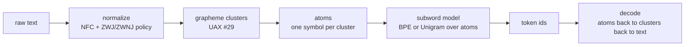
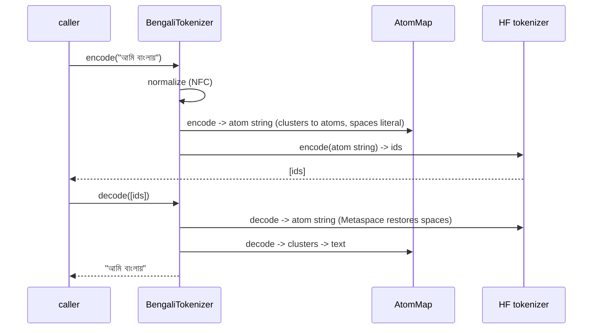

# Architecture: Track A Bengali tokenizer (`bntok`)

This document describes exactly what the tokenizer does and why, module by
module. It is the technical reference for Project Bornomala Track A.

## The one guarantee

A trained token never splits a Bengali grapheme cluster across a boundary. The
conjunct fragmentation rate is 0 by construction, not by tuning. Everything below
exists to make that true while still producing an efficient, modern subword
vocabulary.

## Why grapheme clusters, not codepoints

A Bengali written unit (a base consonant with its conjuncts, reph, phalas, matra,
nukta, and signs) spans 1 to about 8 codepoints but reads as one symbol (spec
section 3.1.1). Character-level BPE can place a token boundary inside such a unit,
producing tokens that correspond to nothing a reader recognises, and error
metrics computed on codepoints understate the damage. So the atomic unit for the
subword model must be the grapheme cluster.

## The pipeline



1. **normalize.py** puts text in NFC (UAX #15) and applies a documented ZWJ /
   ZWNJ policy (preserve by default; they carry ligature intent). No metric or
   merge ever runs on un-normalised text (requirement B-1).
2. **graphemes.py** segments into UAX #29 extended grapheme clusters via the
   `regex` engine's `\X`, and exposes structural predicates (conjunct, reph,
   phala, nukta) used by the evaluator.
3. **atoms.py** builds a reversible map from grapheme cluster to a single Private
   Use Area codepoint (the atom). Frequent clusters get their own atom; every
   codepoint also gets one, so any rare or unseen cluster decomposes rather than
   becoming unknown. The whole Bengali block and ASCII are guaranteed coverage.
4. The Hugging Face `tokenizers` **BPE or Unigram** model trains over atom
   strings. Because each atom is a whole cluster, every learned token is a
   sequence of whole clusters. A Metaspace marker carries word boundaries.
5. **evaluate.py** reports fertility, STRR, bytes per token, grapheme clusters
   per token, and the conjunct fragmentation rate, plus a round-trip check.

## Why fragmentation is structurally impossible

The subword model never sees codepoints inside a cluster; it sees one atom per
cluster. A BPE merge or a Unigram piece combines atoms, so a token is always a
whole number of clusters. Forcing all atoms into the base vocabulary
(`initial_alphabet`) guarantees each covered cluster is a valid single token, so
encode then decode reproduces the exact NFC text.

## Encode and decode



## Robustness

Every public entry point validates its inputs and raises a typed error from
`errors.py` (never a raw traceback). Bad corpus lines are skipped and counted; an
empty corpus, an impossible vocabulary size, a corrupt saved directory, and a
missing font each have a named exception. The design target is that a silent
failure, the worst outcome for a component at the root of the pipeline (risk R1),
cannot happen quietly.

## The artifact

A saved tokenizer is a directory:

```
tok/
  tokenizer.json   the atom-space subword model (Hugging Face format)
  atoms.json       the cluster <-> atom map
  config.json      algorithm, vocab size, normalisation policy, atom counts
```

Load the directory with `BengaliTokenizer.load` to encode and decode. The pair is
portable: it needs the `bntok` package (for normalisation, segmentation, and the
atom remap), not a bespoke runtime.

## What runs where

Induction is CPU-bound and runs anywhere, including the local machine (spec
section 15.2). Large corpus assembly and the full ablation grid (two algorithms
by four vocabulary sizes by two induction corpora) run on the training machine.
Nothing here needs a GPU.

## Relation to the rest of Bornomala

This is Track A, built in the main repository. It is a different thing from the
MotherTongueIndex subproject, which measures and benchmarks tokenizers (and will
benchmark this one once it ships). This module produces the tokenizer; that tool
scores it.
