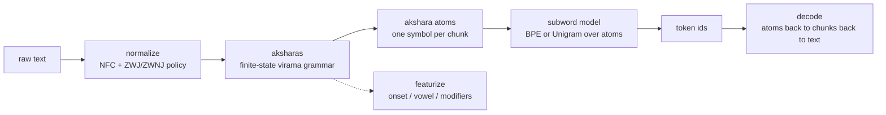
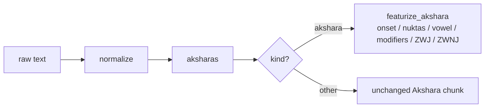

# Architecture: BMBT, Bornomala's Bengali Tokenizer (v2)

This document describes exactly what BMBT does and why, module by module. It
is the technical reference for the v2 tokenizer. For the v1 tokenizer
(`bn-bpe-64k`, package `bntok`'s `BengaliTokenizer`), unaffected by anything
here, see [`docs/architecture.md`](architecture.md).

> **Status.** This is v2 roadmap step 5, *partial*: grammar (the akshara
> finite-state parser) + featural decomposition + a statistical (BPE)
> layer. **Morphology (root/suffix decomposition, sandhi) is explicitly not
> built yet** - deferred, not abandoned. See
> [`docs/design/reading-bengali-on-its-own-terms.md`](design/reading-bengali-on-its-own-terms.md)
> and [`docs/design/FORMAL_SPEC.md`](design/FORMAL_SPEC.md) for the full design
> and its formal contract; [`docs/known-issues.md`](known-issues.md)'s
> "Roadmap: a proposed v2" section for what is and is not built.

## The one difference from v1

v1 discovers Bengali's structure statistically: it segments into UAX #29
grapheme clusters (found by `regex`'s generic Unicode algorithm) and lets BPE
merge them. BMBT parses the structure first, directly from Bengali's own
generative grammar (`bntok.akshara.aksharas()`, a finite-state machine
implementing the virama rule, empirically verified against `regex`'s own `\X`
and measured against real text - see `docs/known-issues.md` points 11-14),
and only then compresses on top of that with the same kind of statistical
model v1 uses.

**Measured, not just predicted: BMBT ties v1, it does not beat it.** Trained
on the identical corpus and vocab size, `bmbt-64k` matches `bn-bpe-64k` on
Wikipedia held-out down to the raw integer token count (17,245 tokens,
11,316 words - identical, despite genuinely different vocabularies), and
ties within a fraction of a percent on the other three registers (tiny real
differences in both directions: marginally fewer tokens, marginally more
fragmented clusters). This confirms, in practice, `FORMAL_SPEC.md`'s own
OPTIMAL-section proof that a BPE constrained to never split an akshara
cannot beat an unconstrained one on raw token count: constraining the merge
search space can only hurt fertility, never help it, and since akshara
boundaries are already nearly identical to grapheme-cluster boundaries on
well-formed Bengali (the v2 roadmap's own step-4 measurement), the two atom
schemes are close to isomorphic on real text, so the tie is expected, not
surprising. Full numbers, the CC-100 ablation, and why this is reported as
a genuine tie rather than a hedge either way, are in
`benchmarks/bengali-comparison.md`.

**What BMBT adds regardless of the fertility outcome** is `bntok.bmbt.featurize()`:
a real, tested structural decomposition of every akshara into its onset
consonants, which carry a nukta, its vowel, its trailing modifiers, and
whether a ZWJ/ZWNJ occurred - an actual output of the tokenizer itself, not
an embedding-layer afterthought bolted on after the fact.

## The pipeline



1. **`normalize.py`** (reused unchanged from v1) puts text in NFC and applies
   the ZWJ/ZWNJ policy. Same requirement as v1: no metric or merge ever runs
   on un-normalised text.
2. **`akshara.py`** (reused unchanged from v1's v2 work) segments into
   aksharas via the finite-state grammar - `Consonant Tail | Vowel Tail`,
   with `Tail` a unified scan absorbing any mixed run of
   {Virama, Nukta, Matra, Modifier, ZWJ, ZWNJ}. Anything that doesn't start a
   Consonant/Vowel branch falls back to exactly one UAX #29 grapheme cluster,
   so every chunk, "akshara" or "other", is always a whole number of
   grapheme clusters.
3. **`bmbt.py`'s `AksharaAtomMap`** builds a reversible map from
   akshara/other chunk text to a single Private Use Area codepoint (the
   atom) - same two-tier scheme as v1's `AtomMap` (frequent chunks get their
   own atom, every codepoint also gets one so rare/unseen chunks decompose
   rather than becoming unknown), but built over `aksharas()` output instead
   of `grapheme_clusters()` output, and with its own distinct UNK atom so
   its atom space is provably disjoint from v1's by construction.
   **`bmbt.py` imports nothing from `atoms.py` or `tokenizer.py`** - a
   deliberately self-contained, parallel implementation, so a future change
   to either v1 file can never silently affect BMBT, and vice versa.
4. The Hugging Face `tokenizers` **BPE or Unigram** model trains over
   akshara-atom strings, exactly the same way v1 trains over
   grapheme-cluster-atom strings (same `Metaspace` word-boundary marker,
   same `initial_alphabet`-forcing for guaranteed round-trip).
5. **`evaluate.py`** (v1's own evaluation function) works on a trained BMBT
   **completely unmodified** - it only calls `encode`/`encode_tokens`/
   `roundtrip_ok`/`config.get("zwnj_policy", ...)`, all of which BMBT exposes
   identically to `BengaliTokenizer`. `tests/test_bmbt.py` includes this as
   a regression test, not just an assumption.

## The featural path (off to the side, outside the vocabulary entirely)



`bmbt.featurize_akshara(chunk)` decomposes one already-segmented akshara
into an `AksharaFeatures` record. It is a strictly smaller problem than
`akshara.py`'s own boundary-finding scan, since the chunk's extent is
already known - it only classifies each codepoint within it, reusing the
same mixed-run tolerance `_scan_tail` had to learn empirically (nukta can
appear before or interleaved oddly around a chaining virama in real text;
a Modifier's presence, not its position, is what blocks chain continuation).
This function needs no trained tokenizer, no vocabulary - it is pure
grammar, callable standalone via `bntok.featurize("...")`.

The decomposition is itself lossless: reconstructing surface text from
`onset`/`nuktas`/`vowel`/`modifiers` (consonants joined by `VIRAMA`, a
`NUKTA` after each nukta-bearing consonant, then the vowel/matra, then the
modifiers) reproduces the original akshara text exactly -
`tests/test_bmbt.py` checks this on the design doc's own named hard words
(স্ত্রী, ক্ষ্ম, আকাঙ্ক্ষা, ঋত্বিক), not just spot-checked by eye.

## The artifact

A saved BMBT tokenizer is a directory, the same shape as v1's:

```
bmbt-tok/
  tokenizer.json   the atom-space subword model (Hugging Face format)
  atoms.json       the akshara-atom map
  config.json      algorithm, vocab size, normalisation policy, atom counts,
                   "format": "bornomala-bmbt/1"  (v1's is "bornomala-track-a/1")
```

`config.json`'s `format` field is the one place an artifact self-identifies
which architecture produced it, so a loader (or a human) never has to guess
from a directory name.

## Robustness

Same discipline as v1: every public entry point validates its inputs and
raises a typed error from `errors.py` (`bmbt.py` adds one new subclass,
`FeaturizeError`, for calling `featurize_akshara` on a chunk with no
akshara-grammar structure - an "other" chunk). Nothing fails silently.

## Relation to the rest of Bornomala

BMBT is the recommended, primary tokenizer as of this writing. `bn-bpe-64k`
(v1) remains fully documented, unchanged, and available - it is still the
artifact behind the published Hugging Face model
(`konko/bornomala-bengali-tokenizer`); BMBT has not been published there yet.
Morphology (v2 roadmap step 5's other half) is future work, tracked in
`docs/known-issues.md`'s roadmap section, not hidden or implied to already
exist.
