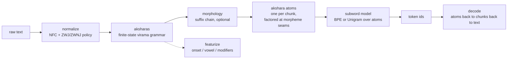
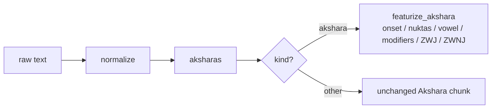

# Architecture: BMBT, Bornomala's Bengali Tokenizer (v2)

This document describes exactly what BMBT does and why, module by module. It
is the technical reference for the v2 tokenizer. For the v1 tokenizer
(`bn-bpe-64k`, package `bntok`'s `BengaliTokenizer`), unaffected by anything
here, see [`docs/architecture.md`](architecture.md).

> **Status.** v2 design step 5 is now **complete**: grammar (the akshara
> finite-state parser) + featural decomposition + morphology + a statistical
> (BPE) layer. Morphology was the missing half and is built, opt-in via
> `--morphology`; see [`docs/bmbt-morphology.md`](bmbt-morphology.md) for the
> layer itself and the measurement that shaped it. Sandhi remains out of
> scope, as does compounding, both for want of a stem lexicon.
>
> See [`docs/design/reading-bengali-on-its-own-terms.md`](design/reading-bengali-on-its-own-terms.md)
> and [`docs/design/FORMAL_SPEC.md`](design/FORMAL_SPEC.md) for the full design
> and its formal contract; [`docs/known-issues.md`](known-issues.md) for what
> is and is not built, and for the BMBT-Hybrid experiment, which was measured,
> failed, and has been removed.

## The one difference from v1

v1 discovers Bengali's structure statistically: it segments into UAX #29
grapheme clusters (found by `regex`'s generic Unicode algorithm) and lets BPE
merge them. BMBT parses the structure first, directly from Bengali's own
generative grammar (`bntok.akshara.aksharas()`, a finite-state machine
implementing the virama rule, empirically verified against `regex`'s own `\X`
and measured against real text - see `docs/known-issues.md` points 11-14),
and only then compresses on top of that with the same kind of statistical
model v1 uses.

**Measured, not just predicted: BMBT ties v1, it does not beat it.** Trained
on the identical corpus and vocab size, `bmbt-64k` matches `bn-bpe-64k` on
Wikipedia held-out down to the raw integer token count (17,245 tokens,
11,316 words - identical, despite genuinely different vocabularies), and
ties within a fraction of a percent on the other three registers (tiny real
differences in both directions: marginally fewer tokens, marginally more
fragmented clusters). This confirms, in practice, `FORMAL_SPEC.md`'s own
OPTIMAL-section proof that a BPE constrained to never split an akshara
cannot beat an unconstrained one on raw token count: constraining the merge
search space can only hurt fertility, never help it, and since akshara
boundaries are already nearly identical to grapheme-cluster boundaries on
well-formed Bengali (the v2 design's own step-4 measurement), the two atom
schemes are close to isomorphic on real text, so the tie is expected, not
surprising. Full numbers, the CC-100 ablation, and why this is reported as
a genuine tie rather than a hedge either way, are in
`benchmarks/bengali-comparison.md`.

**What BMBT adds regardless of the fertility outcome** is `bntok.bmbt.featurize()`:
a real, tested structural decomposition of every akshara into its onset
consonants, which carry a nukta, its vowel, its trailing modifiers, and
whether a ZWJ/ZWNJ occurred - an actual output of the tokenizer itself, not
an embedding-layer afterthought bolted on after the fact.

## The two guarantees, which are not the same guarantee

This is the most important thing to understand about BMBT, and it was
conflated in this project's own documentation until the morphology layer
forced the distinction.

- **Conjunct integrity.** A token boundary never severs a virama-joined
  consonant cluster. `ক্ষ` is never cut into `ক্` + `ষ`, because `ক্` is not a
  unit of the language: it is a consonant with a dangling hasanta, and it
  occurs nowhere in real Bengali text. **This is the guarantee the tokenizer
  exists to provide, and it is absolute.**

- **Akshara atomicity.** A token boundary never splits an orthographic
  syllable, so a consonant cluster is never parted from its matra. `শ্বে` is
  never cut into `শ্ব` + `ে`.

The second is *strictly stronger* than the first, and until the morphology
work it was assumed to be the same claim. It is not. `শ্ব` is a valid
consonant cluster and `ে` is a valid vowel sign; both are units Bengali
literacy teaches by name, and the split destroys nothing. `ক্` is a fragment
corresponding to nothing at all.

Holding akshara atomicity cost 30.4% of all Bengali morpheme boundaries,
because a matra binds orthographically to the consonant before it while
belonging morphologically to the suffix after it. BMBT now keeps conjunct
integrity absolute and relaxes akshara atomicity **only at a morpheme seam**.
The full measurement, and why boundaries that could not be placed correctly
are skipped rather than snapped to a neighbour, is in
[`docs/bmbt-morphology.md`](bmbt-morphology.md).

The consequence is stated rather than hidden: a morphology-enabled artifact
splits **3.349%** of grapheme clusters by design, entirely at morpheme seams,
while its **conjunct fragmentation stays exactly zero**. Verified on 1,468,236
codepoints of held-out text: 99,945 seams forced, zero conjunct-integrity
violations.

## The pipeline



1. **`normalize.py`** (reused unchanged from v1) puts text in NFC and applies
   the ZWJ/ZWNJ policy. Same requirement as v1: no metric or merge ever runs
   on un-normalised text.
2. **`akshara.py`** (reused unchanged from v1's v2 work) segments into
   aksharas via the finite-state grammar - `Consonant Tail | Vowel Tail`,
   with `Tail` a unified scan absorbing any mixed run of
   {Virama, Nukta, Matra, Modifier, ZWJ, ZWNJ}. Anything that doesn't start a
   Consonant/Vowel branch falls back to exactly one UAX #29 grapheme cluster,
   so every chunk, "akshara" or "other", is always a whole number of
   grapheme clusters.
3. **`morphology.py`** (optional, `--morphology`) finds each word's suffix
   chain with a rule-based, inspectable analyser covering case, plural,
   classifiers, verb conjugation, derivational suffixes and clitics. A
   statistical segmenter would have been less work and was rejected for the
   same reason the akshara parser was written by hand rather than delegated
   to `\X`: BMBT's claim is that it reads Bengali by the language's own rules
   rather than inferring them from counts. Each seam becomes a merge barrier,
   and an akshara is factored at the onset/rime seam when a seam falls there.
4. **`bmbt.py`'s `AksharaAtomMap`** builds a reversible map from
   akshara/other chunk text to a single Private Use Area codepoint (the
   atom) - same two-tier scheme as v1's `AtomMap` (frequent chunks get their
   own atom, every codepoint also gets one so rare/unseen chunks decompose
   rather than becoming unknown), but built over `aksharas()` output instead
   of `grapheme_clusters()` output, and with its own distinct UNK atom so
   its atom space is provably disjoint from v1's by construction.
   **`bmbt.py` imports nothing from `atoms.py` or `tokenizer.py`** - a
   deliberately self-contained, parallel implementation, so a future change
   to either v1 file can never silently affect BMBT, and vice versa.
5. The Hugging Face `tokenizers` **BPE or Unigram** model trains over
   akshara-atom strings, exactly the same way v1 trains over
   grapheme-cluster-atom strings (same `Metaspace` word-boundary marker,
   same `initial_alphabet`-forcing for guaranteed round-trip).
6. **`evaluate.py`** (v1's own evaluation function) works on a trained BMBT
   **completely unmodified** - it only calls `encode`/`encode_tokens`/
   `roundtrip_ok`/`config.get("zwnj_policy", ...)`, all of which BMBT exposes
   identically to `BengaliTokenizer`. `tests/test_bmbt.py` includes this as
   a regression test, not just an assumption.

## The featural path (off to the side, outside the vocabulary entirely)



`bmbt.featurize_akshara(chunk)` decomposes one already-segmented akshara
into an `AksharaFeatures` record. It is a strictly smaller problem than
`akshara.py`'s own boundary-finding scan, since the chunk's extent is
already known - it only classifies each codepoint within it, reusing the
same mixed-run tolerance `_scan_tail` had to learn empirically (nukta can
appear before or interleaved oddly around a chaining virama in real text;
a Modifier's presence, not its position, is what blocks chain continuation).
This function needs no trained tokenizer, no vocabulary - it is pure
grammar, callable standalone via `bntok.featurize("...")`.

The decomposition is itself lossless: reconstructing surface text from
`onset`/`nuktas`/`vowel`/`modifiers` (consonants joined by `VIRAMA`, a
`NUKTA` after each nukta-bearing consonant, then the vowel/matra, then the
modifiers) reproduces the original akshara text exactly -
`tests/test_bmbt.py` checks this on the design doc's own named hard words
(স্ত্রী, ক্ষ্ম, আকাঙ্ক্ষা, ঋত্বিক), not just spot-checked by eye.

## Speed: the grammar is now faster than the C regex it replaced

BMBT's one real disadvantage against v1 used to be throughput. Parsing the
grammar in interpreted Python was **4.1x slower** than v1 handing segmentation
to `regex`'s `\X`, which is C. Profiling put 62% of the cost in the scan and
38% in constructing a frozen dataclass per chunk.

Both were addressed, and the ordering of the result is now reversed. Measured
on 6,000 held-out Wikipedia lines (1.08M codepoints):

| Path | Throughput |
|---|--:|
| `aksharas()`, original | 0.66 M cp/s |
| `aksharas()`, after slots and hoisting | 0.78 M cp/s |
| `akshara_bounds()`, no object per chunk | 1.33 M cp/s |
| `grapheme_clusters()`, v1's `\X` C regex | 2.72 M cp/s |
| **`akshara_bounds_batch()`, vectorized** | **6.20 M cp/s** |

The vectorized backend (`akshara_vec.py`, optional via
`pip install "bntok[speed]"`) exploits the fact that the akshara grammar is
regular: the parse state at any position is determined by two segmented
reductions, a running maximum locating where the current run began and two
prefix-sum differences for the virama and blocker flags, rather than a
character-by-character recurrence. Both are O(n) over contiguous memory.

A conservative guard admits only the subset where the array model is provably
equivalent to `\X` (99.4% of measured lines); other scripts' conjuncts, emoji
ZWJ sequences, Hangul and CRLF are partitioned out and answered by the proven
scalar scan. Correctness rests on the guard being conservative, not on the
backend covering all of Unicode. Without numpy everything falls back silently.

Two designs were tried and rejected on measurement, and both are recorded in
the module rather than discarded: a parallel prefix scan over the transition
monoid (correct, since composition is associative, but O(n log n) in gathers
and measured at only 1.33x), and an all-or-nothing batch guard (correct, but
zero of the real 4096-line batches qualified, so it never once took the fast
path).

## What the fragmentation numbers mean now

The morphology layer forced a correction to this project's own measurement.
`conjunct_fragmentation_rate` had three defects, and the second affects every
fragmentation figure published before this change:

1. **It does not measure conjuncts.** It counts any split grapheme cluster, so
   parting a cluster from its matra scored the same as severing the cluster.
2. **Its denominator includes clusters that cannot be split.** Of 697,048
   held-out clusters, 61.0% are a single codepoint. Counting them credits every
   tokenizer for not doing the impossible: 2.56x inflation overall, 1.79x on
   Bengali clusters.
3. **It is binary.** Breaking a three-consonant conjunct scored the same as
   clipping a trailing anusvara.

`fragmentation.py` grades each split by an objective structural test instead.
Severity weights were rejected: a weight is a judgement presented as a
measurement, which rule E4 forbids, so the three counts are reported separately
and the reader applies their own judgement to numbers that are all real.

| Grade | Meaning |
|---|---|
| `destructive` | a virama stranded from its consonant, or a nukta detached from its base (`ড` and `ড়` are different letters) |
| `modifier` | a trailing anusvara, visarga or chandrabindu detached |
| `onset_rime` | a consonant cluster parted from its matra |

Headline is `destructive_rate`, over **splittable** clusters. The legacy field
is kept unchanged so published numbers stay comparable.

The correction reorders the competition. On the same 828 held-out lines, by
the legacy metric DeepSeek-V3 is worst at 24.09% and mBERT is fourth; by actual
destructive damage **mBERT is worst at 15.45%** and DeepSeek second at 10.16%,
because 56.33% of DeepSeek's "fragmentation" is onset/rime and destroys
nothing. Full table: [`benchmarks/bengali-comparison.md`](../benchmarks/bengali-comparison.md).

## The artifact

A saved BMBT tokenizer is a directory, the same shape as v1's:

```
bmbt-tok/
  tokenizer.json   the atom-space subword model (Hugging Face format)
  atoms.json       the akshara-atom map
  config.json      algorithm, vocab size, normalisation policy, atom counts,
                   "format": "bornomala-bmbt/1"  (v1's is "bornomala-track-a/1")
```

`config.json`'s `format` field is the one place an artifact self-identifies
which architecture produced it, so a loader (or a human) never has to guess
from a directory name.

## Robustness

Same discipline as v1: every public entry point validates its inputs and
raises a typed error from `errors.py` (`bmbt.py` adds one new subclass,
`FeaturizeError`, for calling `featurize_akshara` on a chunk with no
akshara-grammar structure - an "other" chunk). Nothing fails silently.

## Relation to the rest of Bornomala

BMBT is the recommended, primary tokenizer as of this writing. `bn-bpe-64k`
(v1) remains fully documented, unchanged, and available - it is still the
artifact behind the published Hugging Face model
(`konko/bornomala-bengali-tokenizer`); BMBT has not been published there yet.
Morphology (v2 design step 5's other half) is now built, opt-in via
`--morphology` - see [`docs/bmbt-morphology.md`](bmbt-morphology.md) for the
layer itself and its measured fertility cost.
