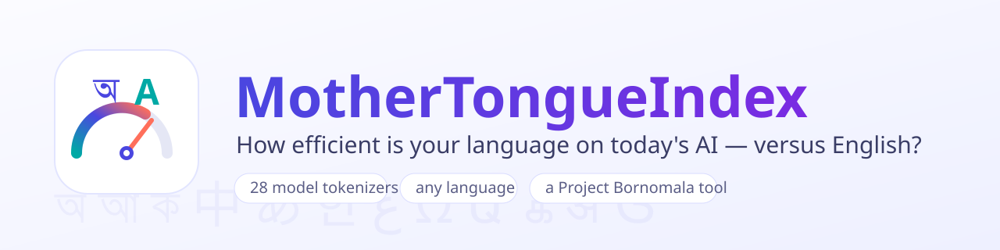

<p align="center">
  
</p>

<p align="center">
  <b>How efficient is your language on today's AI models, versus English?</b>
</p>

<p align="center">
  
  
  
  
  
  
</p>

---

## 🌍 What it is

Paste text in **any language**, pick the AI models you care about, and
MotherTongueIndex runs their **real tokenizers** over it and shows, side by
side, how much your language costs compared to English on each model.

It is an **understanding** tool, not a price calculator. It answers two
questions that are usually left implicit:

1. **💸 Cost.** How many more tokens does my language spend per word than
   English, on this model? That ratio is the headline: the `xEN` column.
2. **🧠 Capability.** Token bloat shrinks the effective context window, and a
   smaller effective window measurably handicaps reasoning in non-English
   languages, not just cost. MotherTongueIndex makes that link explicit.

> **It is a subproject of [Project Bornomala](../README.md).** It does **not**
> train a tokenizer. The Bornomala Bengali tokenizer (Track A) is a separate
> deliverable in the main repo. This tool measures and benchmarks tokenizers,
> and will add the Bornomala tokenizer to its lineup once it ships.

## ⚡ Quick start

```bash
pip install -r requirements.txt

# Your language vs English across a no-auth model set:
python -m mti "আমি বাংলায় গান গাই, আমি বাংলার গান গাই"

# Choose models, explain the cost, show the capability impact:
python -m mti --models gpt-4o,gpt-4,sarvam1,claude --why --capability "आपकी भाषा यहाँ लिखें"

# See the actual token split, list models, emit JSON:
python -m mti --show --models gpt-4o,sarvam1 "কি খবর"
python -m mti --list
python -m mti --json --file sample.txt
```

## 📊 What it finds (real, reproducible)

Same sentence (UDHR Article 1 opening), measured across OpenAI's two tokenizer
generations. Generated by `python data/build_tables.py`:

| Language | Script | GPT-4 (cl100k) xEN | GPT-4o (o200k) xEN |
|---|---|---:|---:|
| English | Latin | 1.0x | 1.0x |
| Spanish | Latin | 1.4x | 1.1x |
| Russian | Cyrillic | 3.0x | 1.5x |
| Arabic | Arabic | 4.2x | 2.0x |
| Hindi | Devanagari | 5.0x | 1.5x |
| **Bengali** | **Bengali** | **7.6x** | **1.7x** |
| Greek | Greek | 5.8x | 2.3x |

Two facts jump out: complex scripts pay a brutal token tax on older tokenizers,
and a single tokenizer generation (cl100k to o200k) collapses most of that gap.
Tokenization, not the language, drives the cost.

## 🧮 What the columns mean

| Column | Meaning | Better |
|---|---|:---:|
| `tokens` | Exact token count from the model's real tokenizer | lower |
| `fert.` | Fertility = tokens / whitespace-words | lower |
| `xEN` | Fertility / this model's English fertility. **The headline.** | near 1.0 |
| `STRR` | Single-token retention: fraction of words kept as one token | higher |
| `b/tok` | UTF-8 bytes per token (script-independent compression) | higher |
| `gc/tok` | Grapheme clusters per token (true characters per token) | higher |

## 🤖 Models covered (28)

- **OpenAI** GPT-5, GPT-4o / 4.1 (`o200k_base`), GPT-4 / 3.5 (`cl100k_base`). Exact, no auth.
- **Open weights** Qwen3, DeepSeek-V3 / R1, Kimi K2, GLM-4, Yi, Phi-4, Falcon, BLOOM, XLM-R, mBERT. Exact, no auth.
- **Indian models** Sarvam-1, Sarvam-M, OpenHathi, IndicBERT, TituLLM (Bengali), Param-1.
- **Gated** Llama 4 / 3.1, Gemma 3, Mistral, Command R. Exact, set `HF_TOKEN`.
- **Claude, Gemini, Grok** have no public tokenizer, so they are clearly-labelled **estimates**, never presented as measured.

## ✅ Honesty rules

- Exact counts and estimates are always distinguished (an `est` flag).
- Capability-impact numbers are **derived** from tokenization, not measured.
  Measuring real reasoning accuracy is a separate opt-in harness
  ([`eval/reasoning_probe.py`](eval/reasoning_probe.py)) meant to run on a
  machine with a model or API key.
- No fabricated numbers anywhere (Project Bornomala rule E4).

## 🗂️ Layout

```
mothertongueindex/
├── mti/            core engine (CPU only)
│   ├── segment.py      grapheme-cluster + script segmentation (UAX #29)
│   ├── backends.py     tiktoken / HF / estimate tokenizer loaders
│   ├── registry.py     the 28-model catalogue
│   ├── metrics.py      fertility, STRR, bytes/token, gc/token
│   ├── baseline.py     English anchoring (reference + parallel modes)
│   ├── capability.py   reasoning-capability impact (derived)
│   ├── languages.py    metadata for 35 languages (the all-languages layer)
│   ├── analyze.py      high-level API
│   └── cli.py          command line
├── web/            light Material 3 website + FastAPI backend
├── docs/           research paper (PAPER.md), architecture, assets
├── data/           parallel samples + generated cross-language tables
└── eval/           measured cross-language reasoning probe
```

## 📚 Documentation

- **[Technical research paper](docs/PAPER.md)**: method, metrics, results, honesty, ethics.
- **[Architecture](docs/architecture.md)**: modules, data flow, diagrams.
- **[Changelog](CHANGELOG.md)**: every change, versioned.
- **[How to cite](CITATION.cff)**.

## 📖 Grounding

Built on Unicode standards: [UAX #29](https://unicode.org/reports/tr29/) text
segmentation (grapheme clusters), [UAX #15](https://unicode.org/reports/tr15/)
normalization (NFC), and the [UDHR](https://www.unicode.org/udhr/) parallel
corpus. See the paper for the full reference list.

---

<p align="center"><sub>A Project Bornomala subproject · Apache-2.0 · Konko Maji</sub></p>
