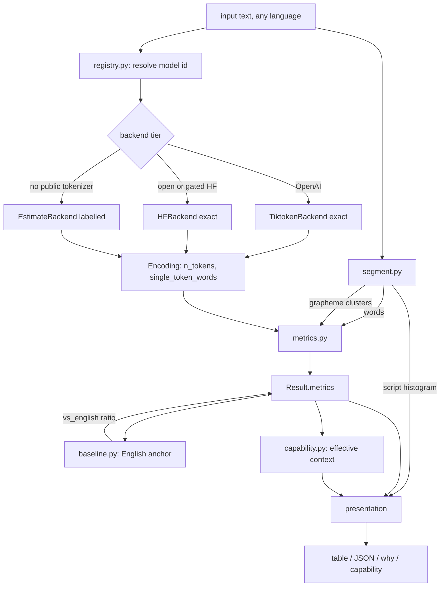
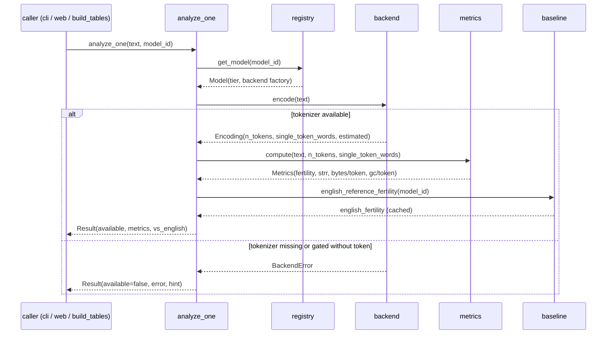

# MotherTongueIndex Architecture

This document describes the internals of the MTI engine: the modules, the data
flow, and the extension points. MTI is a small, pure-CPU Python package with a
clean separation between segmentation, tokenizer backends, metrics, anchoring,
and presentation. There is no training, no GPU code, and no network access
beyond one-time tokenizer downloads.

## Design goals

1. **Exactness where possible, honesty otherwise.** Real tokenizers give exact
   counts. Models with no public tokenizer get a labelled estimate, never a
   silent guess.
2. **Fail soft.** A tokenizer that cannot be fetched marks one model
   unavailable; it never crashes the run.
3. **Unicode-correct.** Characters are grapheme clusters (UAX 29), not
   codepoints, and comparisons normalise (UAX 15) where correctness needs it.
4. **Language-agnostic.** No fixed language list gates analysis. The optional
   language metadata layer is for labels and presets only.
5. **Small surface.** Core dependencies are `regex`, `tiktoken`, `tokenizers`,
   `huggingface_hub`. Everything else is optional.

## Module map

| Module | Responsibility |
|---|---|
| `mti/segment.py` | Whitespace words, UAX 29 grapheme clusters, Unicode script detection and histograms. |
| `mti/backends.py` | Tokenizer backends: `TiktokenBackend`, `HFBackend`, `EstimateBackend`. Each returns an `Encoding` (tokens, count, single-token-word count, estimated flag). |
| `mti/registry.py` | The catalogue of 28 models, each mapping a short id to a display name, a family, an availability tier, and a backend factory. Preset groups. |
| `mti/metrics.py` | Pure functions computing fertility, STRR, bytes/token, codepoints/token, grapheme-clusters/token into a `Metrics` record. |
| `mti/baseline.py` | English anchoring: cached reference fertility per model, reference-mode ratio, exact parallel-mode ratio. |
| `mti/capability.py` | Derived reasoning-capability impact: effective-context ratio, risk bands, window-equivalent content. |
| `mti/analyze.py` | High-level API: `analyze_one`, `analyze`, `analyze_many`, `cost_explanation`. Assembles a `Result` per model. |
| `mti/cli.py` | Command line: table, `--why`, `--capability`, `--show`, `--json`, `--list`, `--group`. |
| `mti/languages.py` | Optional metadata for 35 languages (name, autonym, ISO 639-3, script, family, region, approximate speakers). |
| `eval/reasoning_probe.py` | Opt-in MEASURED cross-language reasoning probe. Runs on a separate GPU or API machine. |
| `data/build_tables.py` | Batch runner: parallel samples times models to `data/tables/`. |

## Data flow

## Sequence of a single analyze call

## The Result record

`analyze_one` returns a `Result` with:

- `model_id`, `display`, `available`, `error`
- `metrics`: the `Metrics` record (tokens, words, fertility, STRR, bytes/token,
  codepoints/token, grapheme-clusters/token, estimated flag, note)
- `tokens`: surface strings for the token split, when requested
- `english_fertility` and `vs_english`: the anchor and the headline ratio

Everything the CLI and the web UI render is derived from this record, which
keeps presentation layers thin and consistent.

## Backends in detail

**TiktokenBackend.** Wraps a named tiktoken encoding (`o200k_base`,
`cl100k_base`). Exact, no authentication, small cached download. Token surface
strings are recovered by decoding each id independently.

**HFBackend.** Loads a tokenizer by Hugging Face repository id. It first tries
`tokenizers.Tokenizer.from_pretrained` (the fast path for a single
`tokenizer.json`), then falls back to `transformers.AutoTokenizer` for
sentencepiece-only repositories. Gated repositories (Llama, Gemma, Mistral,
Command-R) require `HF_TOKEN`. Continuation markers are normalised for readable
token surfaces.

**EstimateBackend.** For Claude, Gemini, and Grok, which publish no tokenizer.
It scores each grapheme cluster with a per-script bytes-per-token prior and a
per-model scale (Gemini and Gemma use a very large multilingual vocabulary, so
they pack non-Latin scripts more tightly than a cl100k-class tokenizer). The
result is always flagged `estimated` and carries an explanatory note.

## Extension points

- **Add a model.** Append one `Model(...)` row in `mti/registry.py` with a
  backend factory. This is how the Project Bornomala Bengali tokenizer will be
  registered once it ships in the main repository.
- **Add a language label.** Append one `Language(...)` row in
  `mti/languages.py`. Analysis does not depend on it; it improves presentation.
- **Add a sample.** Append to `data/samples.json` and rerun
  `data/build_tables.py`.
- **Wire a measured probe.** Provide an `answer_fn` to
  `eval/reasoning_probe.py` to move from derived capability signal to measured
  accuracy gap.

## What lives elsewhere

MTI measures tokenizers. It does not build one. The Bengali tokenizer that
Project Bornomala Track A produces is trained in the main repository, on its own
schedule and hardware plan (parent spec Section 15). When it exists, MTI adds it
as a registry row and benchmarks it like any other model.
